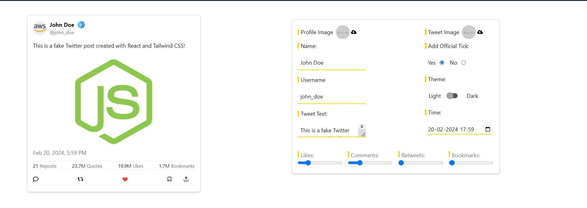

# Social Media Fakepost

## Description

Social Media Fakepost is a web application designed to raise awareness about the prevalence of fake news and misinformation on social media platforms. It provides users with a tool to create realistic-looking fake social media posts, highlighting the ease with which false information can be spread online.

Demo: [Social Media Fakepost Demo](https://rsingh1996.github.io/social-media-fakepost/)

## Features

- Create fake social media posts with customizable content, including text, images, and user profiles.
- Choose from a variety of social media platforms, such as Facebook, Twitter, and Instagram, to mimic the appearance of authentic posts.
- Share generated fake posts to raise awareness and educate others about the dangers of misinformation.

## How to Use

1. Visit the [Social Media Fakepost Demo](https://rsingh1996.github.io/social-media-fakepost/) page.
2. Select the desired social media platform (e.g., Facebook, Twitter, Instagram).
3. Customize the content of the fake post, including text, images, and user profile information.
4. Generate the fake post and review the preview to ensure authenticity.
5. Share the generated fake post on social media platforms or use it for educational purposes.

## Technologies Used

- HTML
- CSS
- JavaScript
- Reactjs
- Tailwind CSS
- Vite
- Git

## Contributing

Contributions to Social Media Fakepost are welcome! If you'd like to contribute to this project, please follow these steps:

1. Fork the project on GitHub.
2. Create a new branch for your feature (`git checkout -b feature/your-feature-name`).
3. Commit your changes (`git commit -m 'Add a new feature'`).
4. Push to your branch (`git push origin feature/your-feature-name`).
5. Create a Pull Request on GitHub.

## Issues

If you encounter any issues while using Social Media Fakepost or have suggestions for improvements, please [open an issue](https://github.com/rsingh1996/social-media-fakepost/issues) on this GitHub repository.

## License

This project is licensed under the MIT License -

---

Thank you for exploring Social Media Fakepost! Together, we can raise awareness and combat misinformation on social media platforms.
